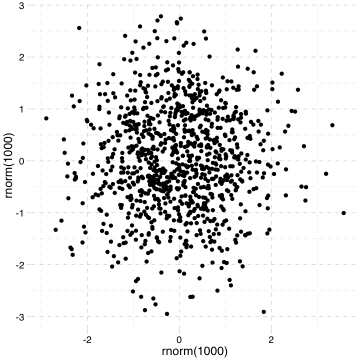

# reveal.js

Presentation template using slidify and reveal.js

---

### The basics

[Slidify](http://www.slidify.org) is an R package that compiles [R-Markdown](http://rmarkdown.rstudio.com/) scripts into html slideshows. The conversion from R-Markdown to html is done via "frameworks." [reveal.js](http://revealjs.com/) is one such framework. This template serves to illustrate some useful features of both slidify and reveal.js.

.fragment Like incremental text.

---

### Aesthetics

reveal.js has _very_ reasonable default themes and aesthetics:

# Level 1 header
## Level 2 header
### Level 3 header
#### Level 4 header
Reg. text.  
<small>
    Small text.  
    [Link](http://mvuorre.github.com)
</small>

<script src="http://ajax.googleapis.com/ajax/libs/jquery/1.9.1/jquery.min.js"></script>

--- 

<section>

### reveal.js also has lots of nice extra stuff

Make sure to press down whenever the down arrow on the right is active

--- ds:soothe

Like this green thing.

</section>

---

<section>

We can easily generate figures from R.


```r
library(ggplot2); library(ggthemes)
qplot(rnorm(1000), rnorm(1000)) + theme_pander()
```



---

We can easily generate __animations__ from R.


```r
for (i in 1:10){
    print( qplot(rnorm(100), rnorm(100)) + 
              scale_y_continuous(limits=c(-2,2)) +
              scale_x_continuous(limits=c(-2,2)) + theme_pander() ) }
```

<video width="360"  controls loop><source src="assets/fig/animation-.webm" />video of chunk animation</video>

</section>

---

# Incremental reveal

.fragment You can click  

.fragment Through stuff  

.fragment If you like.

---

## Incremental reveal with effects

> - point 1  

> - .highlight-red point 2  

> - .grow point 3  

> - .shrink point 4  

> - .highlight-blue point 5  

<script>
$('ul.incremental li').addClass('fragment')
</script>

---

## You can zoom into slides

Press escape to zoom out, and alt+click to zoom in

--- 

## Embedded website

<iframe src='http://rpubs.com/mv2521/mcmc-animation' width = '960px' height = '600px'></iframe>

--- &vertical

## Text side by side

<div class="twocol">
Lorem ipsum dolor sit amet, consectetuer adipiscing elit, sed diam nonummy nibh euismod tincidunt ut laoreet dolore magna aliquam erat volutpat. Ut wisi enim ad minim veniam, quis nostrud exerci tation ullamcorper suscipit lobortis nisl ut aliquip ex ea commodo consequat. Duis autem vel eum iriure dolor in hendrerit in vulputate velit esse molestie consequat, vel illum dolore eu feugiat nulla facilisis at vero eros et accumsan et iusto odio dignissim qui blandit praesent luptatum zzril delenit augue duis dolore te feugait nulla facilisi. Nam liber tempor cum soluta nobis eleifend option congue nihil imperdiet doming id quod mazim placerat facer possim assum. Typi non habent claritatem insitam; est usus legentis in iis qui facit eorum claritatem. Investigationes demonstraverunt lectores legere me lius quod ii legunt saepius.
</div>

--- ds:soothe

## Images side by side

We can put two images side by side using css...

<div class="twocol">  


</div>

--- &twocol

## R plots side by side

Or by using a slide template saved as _templatename.html_ in /assets/layouts/

*** =left
 

*** =right
 

*** =fullwidth
This is better for plots generated in R. Using ```grid.arrange()``` would probably be best for these.

---

### Incorporate a shiny-app to a slide

<div style="text-align:center;width:100%;height:500px;">
     <iframe src="https://jalapic.shinyapps.io/soccerteams/" width="770" height="680">Get a better web browser</iframe>
</div>

